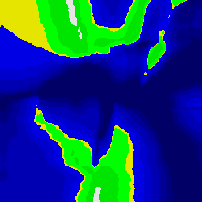

# Tectonical

**Tectonical** is a CLI tool that allows you to generate maps by emulating
tectonic plates.

Usage: `bin/out generate`. This will generate a range of PPM image files. These
should be readable by most image readers. If not, there exist simple conversion
systems.

# Options in config file

## seed

An integer; the value that will be used for the pseudorandom generator within 
the program.

## width & height

Integers; the width and height in pixels of the generated map.

## land-rate

Float between 0 and 1; the approximate proportion of land plates to sea plates.

## tectonic-volatility

Integer between 0 and 255 inclusive; the probability that during the generation
of a tectonic plate the generator will reset the generation. A higher value
results in more smooth/natural shapes for the tectonic plates, while also
increasing processing time. A value of 0 allows only vertical, horizontal, and
diagonal lines between plates.

## tectonic-impact-max-range

A float larger than 0; the maximum range up to which tectonic plates will have
an impact on any pixel. Increases processing time.

## tectonic-impact-diminishing-factor

A float larger than 0; the extent to which an impact between two tectonic
plates diminishes with distance from the position of impact.

## sea-plate-height & land-plate-height

Integers; the height of each plate in question when generated (ie. prior to the
simulation of collisions).

## tectonic-impact-factor

Float; how powerful tectonic collisions are.

## sea-level

Integer; how high the sea level is generated in "real" maps.

## gaussian-range

Integer; the maximum range that the gaussian preprocessing blur will reach. Set
to 0 to disable the gaussian blur.

## gaussian-diminishing-factor

Float less than 0; Similar to tectonic-impact-diminishing-factor, but for the
gaussian blur.